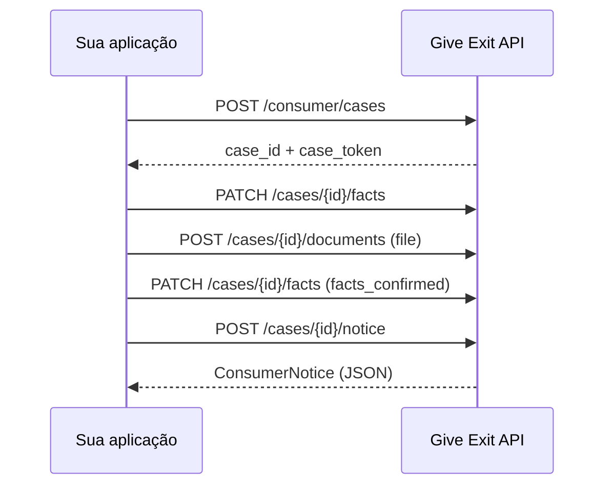

# Tutorial da API Consumer

Guia passo a passo para integrar outra aplicação ao Give Exit e gerar um
rascunho de notificação extrajudicial via HTTP.

Documentação interativa: <http://localhost:8000/docs>

## Visão geral

A geração do rascunho **não é um único POST**. O contrato atual exige um fluxo
com estado efêmero:

```text
1. POST   /consumer/cases                     → cria caso + token
2. PATCH  /consumer/cases/{id}/facts          → preenche fatos
3. POST   /consumer/cases/{id}/documents      → envia evidência (multipart)
4. PATCH  /consumer/cases/{id}/facts          → confirma fatos
5. POST   /consumer/cases/{id}/notice         → gera o rascunho
```

Opcionalmente, entre os passos 1 e 2, você pode usar
`POST /consumer/cases/{id}/messages` para simular o chat de triagem.



## Pré-requisitos

Antes de chamar a geração, confirme que a API está pronta:

```bash
curl http://localhost:8000/health
```

Resposta esperada:

```json
{
  "status": "ok",
  "product": "give-exit-consumer",
  "legal_corpus_ready": true
}
```

Se `legal_corpus_ready` for `false`, execute a pré-indexação legal no host
(veja [README-pt.md](../README-pt.md)) e reinicie a API.

## Base URL e autenticação

| Item | Valor |
|---|---|
| Base URL local | `http://localhost:8000` |
| Base URL Docker (host) | `http://127.0.0.1:8000` |
| Base URL Docker (rede interna) | `http://api:8000` |

### Headers

| Header | Obrigatório | Descrição |
|---|---|---|
| `X-Consumer-Case-Token` | Sim, em todas as rotas do caso | Token opaco retornado em `POST /consumer/cases` |
| `X-API-Key` | Só se `LITIGATION_API_AUTH_KEY` estiver configurado | Chave compartilhada da API |
| `Content-Type: application/json` | Em `PATCH` e `POST` com JSON | — |

Guarde `case_id` e `case_token` juntos. O token **não é recuperável** depois
da criação.

## Passo 1 — Criar caso

```http
POST /consumer/cases
```

Sem corpo. Retorna `201`.

### Exemplo (curl)

```bash
curl -X POST http://localhost:8000/consumer/cases
```

### Exemplo (PowerShell)

```powershell
$created = Invoke-RestMethod -Method Post -Uri "http://localhost:8000/consumer/cases"
$caseId = $created.case_id
$token = $created.case_token
```

### Resposta

```json
{
  "case_id": "734f5a1d12b747ef9e9b8d38001a63e8",
  "case_token": "OOXPgZig8YhRlljd_K9sc_sMI1QHwSMyEZkxn6SbRMU",
  "case": {
    "case_id": "734f5a1d12b747ef9e9b8d38001a63e8",
    "status": "collecting_facts",
    "ready_for_notice": false,
    "facts_confirmed": false,
    "missing_fields": ["bank_name", "consumer_name", "issue_category", ...]
  },
  "assistant_message": "Conte o que aconteceu..."
}
```

## Passo 2 (opcional) — Enviar mensagem de chat

```http
POST /consumer/cases/{case_id}/messages
Content-Type: application/json
X-Consumer-Case-Token: {case_token}
```

### Payload

```json
{
  "text": "O Nubank fez uma cobrança de R$ 120,00 em julho de 2026 que não reconheço.",
  "client_message_id": "msg-1"
}
```

| Campo | Tipo | Obrigatório | Descrição |
|---|---|---|---|
| `text` | string | Sim | 1–20.000 caracteres |
| `client_message_id` | string | Não | Idempotência; reenvio devolve a mesma resposta |

A triagem determinística pode extrair alguns fatos do texto, mas **não substitui**
o `PATCH /facts` para integração B2B.

## Passo 3 — Preencher fatos

```http
PATCH /consumer/cases/{case_id}/facts
Content-Type: application/json
X-Consumer-Case-Token: {case_token}
```

### Payload de exemplo

```json
{
  "consumer_name": "Pessoa Consumidora",
  "bank_name": "Banco Exemplo",
  "issue_category": "unauthorized_charge",
  "complaint_summary": "Foi debitada uma cobrança não reconhecida e o atendimento não resolveu.",
  "incident_date_or_period": "julho de 2026",
  "prior_protocols": ["PROTOCOLO-123"],
  "direct_loss_amount": "100.00",
  "improper_payment_amount": "100.00",
  "article_42_double_repayment_requested": true,
  "unsuccessful_scenario_cost_amount": "50.00",
  "desired_resolution": "estorno da cobrança e encerramento da controvérsia",
  "response_deadline_business_days": 10
}
```

### Campos obrigatórios para gerar rascunho

| Campo | Descrição |
|---|---|
| `consumer_name` | Nome do consumidor |
| `bank_name` | Empresa, fornecedor ou instituição |
| `issue_category` | Categoria da reclamação (ver tabela abaixo) |
| `complaint_summary` | Resumo do problema |
| `incident_date_or_period` | Data ou período do incidente |
| `desired_resolution` | O que o consumidor espera |

### Valores de `issue_category`

| Valor | Significado |
|---|---|
| `unauthorized_charge` | Cobrança não reconhecida ou indevida |
| `fraud` | Fraude, golpe ou compra não reconhecida |
| `account_block` | Bloqueio de conta, acesso ou valores |
| `negative_credit_record` | Registro negativo de crédito |
| `loan_or_interest` | Empréstimo, financiamento ou juros |
| `service_failure` | Problema com produto ou serviço |
| `over_indebtedness` | Superendividamento |
| `other` | Outra controvérsia de consumo |

### Exemplo (curl)

```bash
curl -X PATCH "http://localhost:8000/consumer/cases/CASE_ID/facts" \
  -H "Content-Type: application/json" \
  -H "X-Consumer-Case-Token: CASE_TOKEN" \
  -d '{
    "consumer_name": "Pessoa Consumidora",
    "bank_name": "Banco Exemplo",
    "issue_category": "unauthorized_charge",
    "complaint_summary": "Foi debitada uma cobrança não reconhecida.",
    "incident_date_or_period": "julho de 2026",
    "desired_resolution": "estorno da cobrança"
  }'
```

Neste ponto `ready_for_notice` ainda será `false` (faltam evidência e confirmação).

## Passo 4 — Enviar evidência

```http
POST /consumer/cases/{case_id}/documents
Content-Type: multipart/form-data
X-Consumer-Case-Token: {case_token}
```

### Formulário

| Campo | Tipo | Descrição |
|---|---|---|
| `file` | arquivo | PDF, PNG, JPG ou JPEG (máx. 20 MB) |

O arquivo passa por extração de texto/OCR e varredura de prompt injection. Só
documentos **aceitos** entram no RAG.

### Exemplo (curl)

```bash
curl -X POST "http://localhost:8000/consumer/cases/CASE_ID/documents" \
  -H "X-Consumer-Case-Token: CASE_TOKEN" \
  -F "file=@/caminho/para/extrato.pdf;type=application/pdf"
```

### Exemplo (PowerShell)

```powershell
$headers = @{ "X-Consumer-Case-Token" = $token }
$form = @{ file = Get-Item "C:\caminho\para\extrato.pdf" }
Invoke-RestMethod -Method Post `
  -Uri "http://localhost:8000/consumer/cases/$caseId/documents" `
  -Headers $headers -Form $form
```

### Resposta (trecho)

```json
{
  "case": { "ready_for_notice": false, ... },
  "document": {
    "evidence_id": "abc123...",
    "filename": "extrato.pdf",
    "status": "accepted",
    "security_assessment": { "scan_complete": true, ... },
    "monetary_references": [
      { "amount": "100.00", "quote_sha256": "..." }
    ]
  }
}
```

Status possíveis do documento: `accepted`, `accepted_with_warning`,
`review_required`, `blocked`. Para gerar rascunho, é necessário pelo menos um
documento aceito pela varredura (`safe_document` indexável).

## Passo 5 — Confirmar fatos

```http
PATCH /consumer/cases/{case_id}/facts
Content-Type: application/json
X-Consumer-Case-Token: {case_token}
```

### Payload

```json
{
  "facts_confirmed": true
}
```

Também é possível enviar fatos e confirmação no mesmo `PATCH`:

```json
{
  "consumer_name": "Pessoa Consumidora",
  "facts_confirmed": true
}
```

Após este passo, com evidência aceita, `ready_for_notice` deve ser `true`.

## Passo 6 — Gerar rascunho

```http
POST /consumer/cases/{case_id}/notice
X-Consumer-Case-Token: {case_token}
```

Sem corpo. Pode demorar de segundos a vários minutos (depende do modelo de
embedding e do compositor configurado).

### Exemplo (curl)

```bash
curl -X POST "http://localhost:8000/consumer/cases/CASE_ID/notice" \
  -H "X-Consumer-Case-Token: CASE_TOKEN" \
  -o rascunho.json
```

### Resposta (`ConsumerNotice`)

```json
{
  "notice_id": "...",
  "title": "Notificação extrajudicial com proposta de acordo",
  "full_text": "# Notificação extrajudicial...",
  "legal_grounds": [
    {
      "authority": {
        "law_id": "cdc",
        "article_key": "42",
        "official_url": "https://www.planalto.gov.br/...",
        "status": "active"
      },
      "application_to_facts": "..."
    }
  ],
  "evidence_references": [
    {
      "filename": "extrato.pdf",
      "page": 1,
      "quote": "...",
      "quote_sha256": "..."
    }
  ],
  "settlement": {
    "public_proposal_amount": "100.00",
    "methodology_version": "consumer-settlement-scenario-v3",
    "is_legal_outcome_prediction": false
  },
  "retrievals": [ ... ],
  "warnings": [],
  "corpus_sha256": "...",
  "legal_ground_policy_version": "consumer-ground-eligibility-v1",
  "legal_ground_policy_review_status": "requires_legal_review"
}
```

O campo principal para exibir ao usuário é `full_text` (Markdown). Os demais
campos sustentam auditoria, exportação e revisão jurídica.

## Exportação após gerar

| Método | Rota | Retorno |
|---|---|---|
| `GET` | `/consumer/cases/{id}/notice` | JSON estruturado |
| `GET` | `/consumer/cases/{id}/notice.md` | Markdown puro |
| `GET` | `/consumer/cases/{id}/notice.pdf` | PDF |
| `GET` | `/consumer/cases/{id}/notice.docx` | DOCX |
| `GET` | `/consumer/cases/{id}/notice/retrievals` | Traces de recuperação RAG |

```bash
curl "http://localhost:8000/consumer/cases/CASE_ID/notice.pdf" \
  -H "X-Consumer-Case-Token: CASE_TOKEN" \
  -o notificacao.pdf
```

## Script completo (PowerShell)

```powershell
$base = "http://localhost:8000"

# 1. Criar caso
$created = Invoke-RestMethod -Method Post -Uri "$base/consumer/cases"
$caseId = $created.case_id
$token = $created.case_token
$headers = @{ "X-Consumer-Case-Token" = $token }

# 2. Fatos
$facts = @{
  consumer_name = "Pessoa Consumidora"
  bank_name = "Banco Exemplo"
  issue_category = "unauthorized_charge"
  complaint_summary = "Foi debitada uma cobrança não reconhecida."
  incident_date_or_period = "julho de 2026"
  prior_protocols = @("PROTOCOLO-123")
  direct_loss_amount = "100.00"
  improper_payment_amount = "100.00"
  article_42_double_repayment_requested = $true
  desired_resolution = "estorno da cobrança"
} | ConvertTo-Json
Invoke-RestMethod -Method Patch -Uri "$base/consumer/cases/$caseId/facts" `
  -Headers $headers -ContentType "application/json" -Body $facts

# 3. Upload
$form = @{ file = Get-Item "C:\caminho\para\extrato.pdf" }
Invoke-RestMethod -Method Post -Uri "$base/consumer/cases/$caseId/documents" `
  -Headers $headers -Form $form

# 4. Confirmar
Invoke-RestMethod -Method Patch -Uri "$base/consumer/cases/$caseId/facts" `
  -Headers $headers -ContentType "application/json" -Body '{"facts_confirmed":true}'

# 5. Gerar rascunho
$notice = Invoke-RestMethod -Method Post -Uri "$base/consumer/cases/$caseId/notice" `
  -Headers $headers
$notice.title
$notice.full_text
```

## Códigos de erro comuns

| HTTP | Causa provável | Ação |
|---|---|---|
| `401` | `X-API-Key` ausente ou inválida | Configure o header quando a API exigir chave |
| `404` | `case_id` ou token inválido | Crie um novo caso |
| `409` | Caso incompleto (`ready_for_notice: false`) | Verifique `missing` no corpo ou campos faltantes |
| `413` | Arquivo maior que 20 MB | Reduza o arquivo |
| `422` | Payload ou arquivo inválido | Revise formato, assinatura do arquivo ou campos |
| `503` | Índice legal ausente ou falha no RAG | Verifique `/health` e evidências aceitas |

Exemplo de `409`:

```json
{
  "detail": {
    "message": "Consumer case is not ready",
    "missing": ["accepted_evidence", "facts_confirmation"]
  }
}
```

Exemplo de `503` (índice legal):

```json
{
  "detail": "A base legal do modelo configurado ainda não foi pré-indexada. Execute `python -m app.consumer.preindex_legal` e reinicie a API."
}
```

## Boas práticas para integração

1. **Verifique `/health` antes do fluxo** — evita 503 por índice ausente.
2. **Guarde `case_token` com segurança** — é a credencial de posse do caso.
3. **Use timeout longo no passo 6** — 2 a 20 minutos conforme o ambiente.
4. **Não reenvie `POST /notice` em loop** — a operação é pesada; trate `503`
   com backoff.
5. **Apague o caso ao finalizar** — `DELETE /consumer/cases/{id}` remove vetores
   de evidência da memória/volume.
6. **Casos são efêmeros** — reiniciar a API apaga casos em memória; o índice
   legal persiste em `data/`.

## Referência rápida de rotas

| Método | Rota | Finalidade |
|---|---|---|
| `GET` | `/health` | Vida da API e prontidão do corpus legal |
| `POST` | `/consumer/cases` | Criar caso efêmero e token |
| `GET` | `/consumer/cases/{id}` | Consultar caso autorizado |
| `POST` | `/consumer/cases/{id}/messages` | Adicionar mensagem |
| `PATCH` | `/consumer/cases/{id}/facts` | Revisar, corrigir e confirmar fatos |
| `POST` | `/consumer/cases/{id}/documents` | Enviar evidência |
| `POST` | `/consumer/cases/{id}/notice` | Gerar notificação fundamentada |
| `GET` | `/consumer/cases/{id}/notice` | Ler saída estruturada |
| `GET` | `/consumer/cases/{id}/notice.{md,pdf,docx}` | Exportar notificação |
| `GET` | `/consumer/cases/{id}/notice/retrievals` | Auditar recuperação |
| `DELETE` | `/consumer/cases/{id}` | Apagar caso e vetores de evidência |
