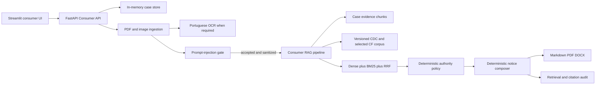

# Architecture

## Scope

Give Exit has one bounded product journey: a Brazilian consumer creates a draft
extrajudicial notice from confirmed facts, accepted evidence and versioned legal
sources. The runtime contains no company-side litigation analysis, defense
strategy, court-record enrichment or general-purpose legal agent.

## Runtime topology

## Package boundaries

| Package | Responsibility |
|---|---|
| `app/api` | Consumer HTTP contract, auth, rate limiting and bounded uploads |
| `app/consumer` | Intake, state, legal corpus, policy, settlement and notice |
| `app/ingestion` | PDF/image validation, text extraction and OCR |
| `app/security` | Prompt-injection detection, sanitization and telemetry privacy |
| `app/rag` | Chunking, embeddings, Chroma, BM25/RRF and optional reranking |
| `app/llm` | Provider-neutral client used by bounded semantic security review |
| `app/reporting` | PDF and DOCX conversion from canonical notice Markdown |
| `app/evaluation` | Consumer legal retrieval and document-security benchmarks |
| `app/schemas` | Shared typed ingestion, retrieval, trace and security contracts |

## Request lifecycle

1. `POST /consumer/cases` creates an ephemeral record and an opaque possession
   token. The raw token is never stored; the case repository stores its hash.
2. Deterministic intake records only explicit text. Every material edit clears
   prior confirmation and invalidates any existing notice.
3. Uploads stream to a randomized temporary path under a fixed 20 MB ceiling.
   Extension, media type and magic bytes must agree.
4. Text extraction runs with a page ceiling. PNG/JPEG and unresolved scanned
   PDF pages require OCR; unavailable OCR fails closed for Consumer evidence.
5. Deterministic bilingual rules scan all pages. Balanced mode sends only
   bounded suspicious excerpts to the configured LLM; strict mode semantically
   reviews the full bounded document and fails closed if its budget is exceeded.
6. Only content allowed by the security policy is sanitized and retained as
   evidence. The raw temporary file is deleted at the route boundary.
7. Notice generation indexes a synthetic combined evidence document and ensures
   the canonical legal corpus is indexed.
8. Legal and evidence queries run in hybrid mode. Dense and BM25 candidates are
   fused deterministically with reciprocal-rank fusion; reranking is optional.
9. Legal chunks must pass status, provenance, score and corroboration rules.
   Evidence citations resolve back to original filename and page mappings.
10. The settlement component is a transparent scenario calculation, not an
    outcome prediction. The notice is assembled without generative prose.
11. Retrieval traces mark raw ranks, merge winners and chunks used in the final
    artifact. The API exposes these traces to the case-token holder.
12. Deleting a case removes its evidence vectors. Startup purges orphaned
    evidence while retaining the canonical legal corpus.

## LLM and embedding boundaries

The LLM provider and embedding provider are independent.

- The LLM may classify bounded suspicious excerpts for prompt-injection risk.
- The LLM does not extract case facts, choose legal grounds or write notices.
- Embeddings represent legal chunks, evidence chunks and retrieval queries.
- The offline mock embedding is deterministic and suitable only for tests.
- Model name and optional revision are part of the collection identity.
- Query instructions and their hashes are captured in evaluation and traces.

## Legal provenance

The CDC snapshot is stored with retrieval date, official URL and SHA-256
manifest. Corpus parsing preserves stable provision/subdivision IDs and source
hashes. Selected CF provisions use the same typed legal schema. Runtime requests
never fetch or silently update law.

Retrieval does not decide legal applicability. A deterministic policy filters
inactive, unknown, weak or insufficiently corroborated chunks. The policy and
corpus both declare review status so the application cannot present engineering
labels as lawyer-certified law.

## Audit model

Each `RetrievalTrace` contains:

- query and query hash;
- agent/component label and batch identity;
- embedding model and optional revision;
- query instruction and hash;
- retrieval mode, candidate depth and fusion parameters;
- vector index and chunking versions;
- rank, score, chunk ID, page range and source hashes;
- merge and final-context selection flags;
- latency and failure fields.

Text previews are disabled by default to minimize sensitive-data retention.
Legal and evidence citations in the notice are reconstructed from selected
chunks and canonical metadata.

## State and privacy

Consumer records, messages, safe extracted documents, notices and raw retrieval
traces currently live in process memory. Chroma persists vectors. This is
adequate for a local demonstration but not for public multi-tenant production.

A production replacement requires authenticated users, tenant-scoped
authorization, encrypted PostgreSQL/object storage, consent and retention
records, deletion jobs, access audit, queue-backed workers, per-tenant vector
filters and explicit PII minimization in exported artifacts.

## Failure behavior

- Invalid or oversized uploads fail before ingestion.
- Missing OCR fails closed for image evidence.
- High-risk or critical prompt injection prevents automated use of the file.
- Retrieval failure or insufficient eligible evidence prevents notice creation.
- Missing facts, confirmation, consumer relationship or accepted evidence
  returns an explicit readiness error.
- No generated citation or legal assertion is allowed to bypass the
  deterministic source and policy gates.

## Evaluation

The Consumer golden suite fixes dataset hash, corpus release/hash, query-builder
version, retrieval configuration and ranked results. Metrics include exact and
article Recall, MRR, NDCG, subdivision precision, hard-negative rate, inactive
or unknown authority rates and out-of-scope abstention.

The prompt-injection benchmark covers deterministic and semantic-only attacks,
benign legal imperatives and category-level false positives. Both datasets are
engineering artifacts and require independent legal/security review before
production claims.

## ADR index

- [0002](adr/0002-llm-provider-abstraction.md) — provider-neutral LLM boundary
- [0003](adr/0003-chromadb-vector-store.md) — embedded vector store
- [0005](adr/0005-pymupdf-ocr-fallback.md) — extraction and OCR
- [0006](adr/0006-section-aware-chunking.md) — evidence chunking
- [0007](adr/0007-deterministic-report-composer.md) — deterministic notice
- [0008](adr/0008-citation-based-groundedness.md) — reconstructed citations
- [0010](adr/0010-prompt-injection-security-gate.md) — untrusted documents
- [0011](adr/0011-retrieval-traceability-and-evaluation.md) — retrieval audit
- [0012](adr/0012-bounded-consumer-extrajudicial-notice.md) — product boundary
- [0013](adr/0013-versioned-consumer-law-retrieval.md) — legal corpus and RAG
