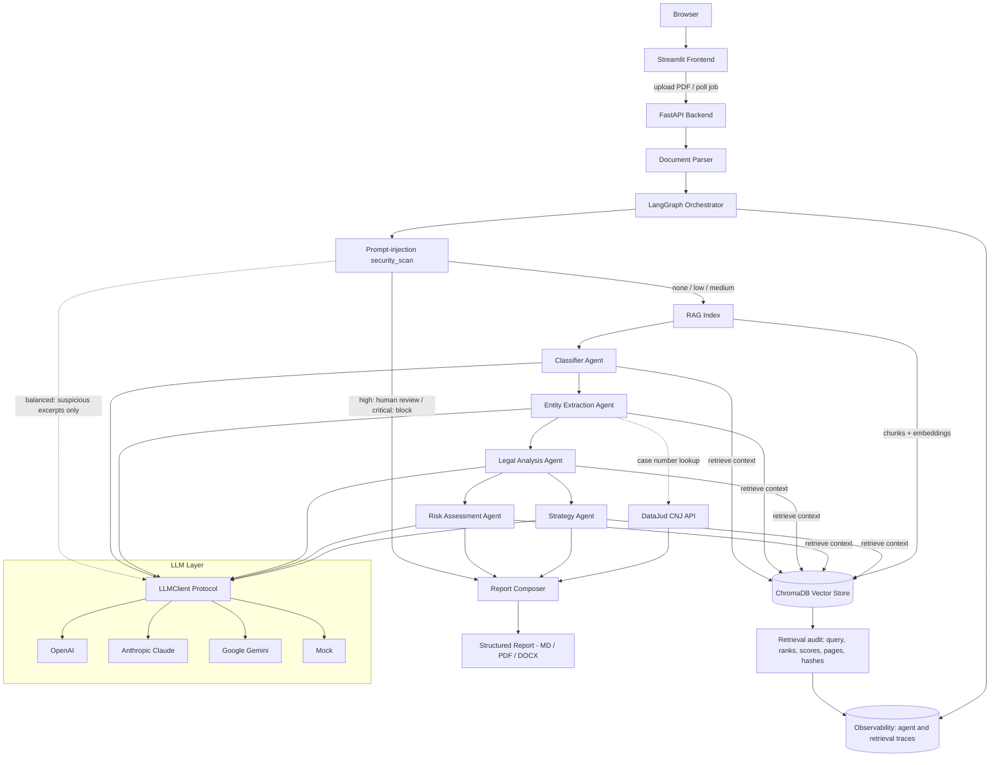

# Architecture

## System overview

## Layers

| Layer | Location | Responsibility |
|---|---|---|
| Core | `app/core` | Config, logging. No business logic. |
| LLM | `app/llm` | Provider-agnostic LLM access with built-in metering. |
| Schemas | `app/schemas` | Pydantic domain models - the contract between all agents. |
| Ingestion | `app/ingestion` | PDF -> text, OCR fallback, language detection. |
| Security | `app/security` | Bilingual prompt-injection detection, routing policy and context masking. |
| Consumer | `app/consumer` | Guided intake, versioned CDC corpus, evidence and notice composition. |
| RAG | `app/rag` | Document/legal chunking, embeddings, BM25+RRF, reranking and vector stores. |
| Evaluation | `app/evaluation` | Business golden plus Consumer statutory-retrieval bake-offs. |
| Agents | `app/agents` | Specialized agents; each = role + prompt + input/output schema. |
| Orchestration | `app/orchestration` | LangGraph graph wiring agents into a pipeline. |
| Services | `app/services` | Use cases (analyze lawsuit, export report). |
| API | `app/api` | FastAPI routes, async job management. |
| Frontend | `frontend/` | Streamlit UI. |

## Key principles

1. **Dependency rule**: outer layers depend on inner layers, never the
   reverse. Agents depend on `LLMClient` (protocol), not on OpenAI.
2. **Contracts as Pydantic schemas**: every agent's input and output is a
   validated model. Structured outputs are enforced at the API level
   (`response_format`), not with "please answer in JSON" prompts.
3. **Observability by construction**: `LLMCallMetadata` travels with every
   response - cost/latency/token tracking cannot be forgotten.
4. **Explainability with an explicit limit**: important model conclusions use
   confidence, reasoning and source-chunk IDs. The backend reconstructs quote
   and page; a deterministic gate reports missing/rejected sources and
   citation-to-context coverage. This is source integrity, not semantic
   entailment, legal correctness or calibrated outcome probability.
5. **Swappable infrastructure**: OpenAI, Claude, Gemini and Mock share the
   typed LLM port; embedding and vector-store adapters are selected separately
   at composition roots. Claude uses a local embedding model in `auto` mode
   because Anthropic does not expose an embeddings API.
6. **Untrusted document boundary**: every page passes through
   `security_scan` before indexing. Deterministic Portuguese/English rules
   always run; `balanced` mode uses the LLM only to review suspicious
   excerpts, while explicit `strict` mode reviews all page text in bounded
   batches. The model cannot override the deterministic routing policy.
7. **Retrieval provenance by construction**: each agent trace retains every
   query's raw top-k ranking and separately marks the deduplicated chunks that
   reached the prompt. Live in-memory traces retain the query. Before Business
   traces enter durable JSONL, the query is replaced by a hash-linked marker;
   full chunks, vectors, previews, section labels and arbitrary source metadata
   are excluded. Consumer traces remain in the in-memory case.
8. **Statutes as versioned primary sources**: the Consumer path indexes an
   integrity-checked offline snapshot of the compiled CDC. Chunks follow legal
   subdivisions, never cross articles, retain source/status/hierarchy hashes,
   and exclude inactive units from generated authorities. Selected
   constitutional provisions are transcribed from the official compiled text.
   Business and Consumer use separate indexes; the Consumer namespace includes
   the canonical corpus hash while the Business default remains dense retrieval
   over the uploaded filing only.
9. **Legal retrieval is candidate generation**: Consumer grounds must clear a
   versioned category-to-provision eligibility policy and cross-query/channel
   support checks. The notice exposes that policy's version and
   `requires_legal_review` status; rank alone cannot become an authority.

## Legal-assistance and source boundary

The product provides legal information and decision support, not legal advice.
Every automated artifact requires qualified human review; the current Consumer
warning is not an authenticated lawyer-approval workflow.

The Business graph retrieves only from chunks derived from the uploaded filing.
Consequently, its legal analysis, risk and strategy describe or reason from the
filing's allegations; a statute or precedent quoted by a party is not
independently verified law. DataJud is current-record lookup/enrichment, not a
merits or authority corpus. A trace should be treated as filing-grounded unless
it explicitly names another authoritative corpus. The current authoritative
corpus path is Consumer-only: a pinned CDC snapshot plus selected constitutional
provisions. Independent Brazilian legal review of that corpus and its retrieval
labels remains required.

## Citation and source-integrity boundary

Conclusion-producing Business agents, including the classifier, receive
bounded RAG context with stable chunk IDs. The model must select a `chunk_id`;
its optional quote/page values are not trusted. At composition time the backend
requires a unique chunk belonging to the current document and reconstructs a
substantive verbatim excerpt and page from both the chunk and
`ParsedDocument`. Unknown, foreign, duplicate or source-inconsistent IDs are
removed.

`LitigationReport.evidence_quality` summarizes verified/rejected citations,
conclusions without reconstructed citations and producing-agent context
coverage. `passed` means those deterministic checks passed. It does **not** mean
the excerpt entails the conclusion, the legal analysis is correct, confidence
is calibrated, or the artifact is fit to file.

## Retrieval audit and evaluation

The runtime trace records agent, query and query hash, retrieval mode,
requested/candidate `k`, chunking policy, embedding/query instruction/model
revision, index, RRF weights, reranker, score type, latency, raw rank and score,
document/chunk ID, section, page span, indexed-text/source hashes, structured
legal-source metadata, and prompt inclusion. The trace remains
nested under the agent so parallel LangGraph branches cannot lose attribution.
Embedding and vector-search failures retain attempted queries, successful
sibling lookups, and the consuming agent's status/error instead of disappearing
from the audit trail.

Runtime reports expose descriptive telemetry and citation-to-context coverage.
Relevance metrics require labels, so Precision@K, Recall@K, HitRate@K, MRR@K,
and NDCG@K run offline against golden page-range and passage judgments.
The separate Consumer seed pins the exact corpus hash and adds graded statutory
labels, article/subdivision metrics, hard negatives, inactive-authority checks,
no-ground abstention, retrieval failure coverage, and category/slice summaries.

## Persistence, privacy and execution boundary

The Business job registry, full reports and current raw retrieval traces live in
process memory. Completed Business run metadata and minimized retrieval traces
are appended to local JSONL and remain queryable after the in-memory job is
evicted. Consumer cases, notices and retrieval traces are in memory only; a
restart loses them. Durable history does not recreate either workflow.

Before a Business `RunRecord` is appended, natural-language queries become
`[QUERY_REDACTED:<hash-prefix>]`, filenames and reviewer labels become HMAC
references, reviewer comments/sections/previews/arbitrary source metadata are
omitted, and errors become bounded exception-type markers. This boundary is not
full anonymization: current job endpoints expose raw traces and hashes or
pseudonymous metadata can still be personal data. Pseudonyms correlate across processes only when a
high-entropy `LITIGATION_TELEMETRY_PSEUDONYM_KEY` is configured securely.

`AnalysisJobManager` limits one process to configured concurrent plus queued
reservations; excess submissions receive `503` and `Retry-After`. The queue is
an asyncio semaphore/backlog, not a broker. Restart loses queued, running and
review-pending jobs; replicas have independent job IDs, capacity and state.
Horizontal production deployment therefore requires a durable broker, shared
job state and horizontally safe persistence.

`review_required` state has separate count and TTL limits because it retains a
parsed document for possible resume. Eviction occurs only after durable audit;
if the audit write fails, the run fails closed and discards the rich state so a
storage outage cannot bypass the memory/privacy bound.

Compose binds API and frontend ports to `127.0.0.1` by default. Local mode may
run without authentication, but `deployment_mode=production` refuses startup
without the deployment-wide API key. That key is not per-user identity, RBAC or
tenant isolation.

Committed PDFs are inventoried in `demo/manifest.json` with hashes,
synthetic/personal-data classification, provenance and review status. A public
court record can still carry personal data and redistribution restrictions;
public accessibility is not permission to redistribute it and does not waive
LGPD or court-term obligations. The retained real record therefore requires an
independent rights/privacy review before republication.

## Prompt-injection routing

| Risk | Pipeline action |
|---|---|
| `none` / `low` | Continue to indexing and analysis. |
| `medium` | Continue with a report warning; mask flagged excerpts in downstream prompts while preserving the source document. |
| `high` | Halt analysis with job state `review_required`, pending a human decision. |
| `critical` | End with job state `blocked`. |

A `review_required` halt is the only state a human can lift, through
`POST /analyses/{job_id}/review`. The decision enters the graph as
`AnalysisState.human_review`, so the router itself stays deterministic:
approval re-runs the pipeline with findings still masked and the reviewer
recorded in the report warnings; rejection ends the run as `rejected`. The
immutable decision is bound to job, document and security-assessment hash and
is persisted before a resume is scheduled. The submitted reviewer label is
self-declared; durable telemetry pseudonymizes it, but no user authentication
proves the person's identity. The router requires `scan_complete` and a
`human_review` action, so neither a
`blocked` verdict nor a failed scan can be approved through this path.

Every finding records the category, severity, source page, verbatim excerpt,
reasoning and confidence. Findings are part of the structured report and are
shown in the frontend and exports.

## Design decisions

Recorded as ADRs in [`docs/adr/`](adr/). Highlights:

- [0001](adr/0001-use-langgraph.md) - LangGraph over LangChain chains
- [0002](adr/0002-llm-provider-abstraction.md) - Own LLM port instead of LiteLLM
- [0003](adr/0003-chromadb-vector-store.md) - ChromaDB behind a VectorStore port
- [0004](adr/0004-async-first.md) - Async-first from day one
- [0008](adr/0008-citation-based-groundedness.md) - Evidence IDs and deterministic source reconstruction
- [0009](adr/0009-in-process-async-jobs.md) - Bounded single-process jobs, not a durable queue
- [0010](adr/0010-prompt-injection-security-gate.md) - Pre-index prompt-injection security gate
- [0011](adr/0011-retrieval-traceability-and-evaluation.md) - Retrieval audit and ranking metrics
- [0013](adr/0013-versioned-consumer-law-retrieval.md) - Versioned statutes and hybrid legal retrieval
- [0014](adr/0014-human-review-resume-path.md) - Bound, persisted review decisions with self-declared identity
